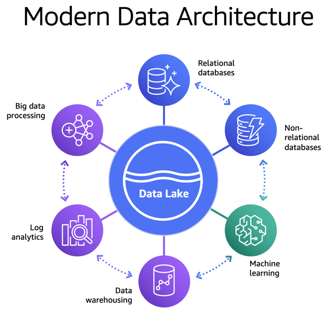
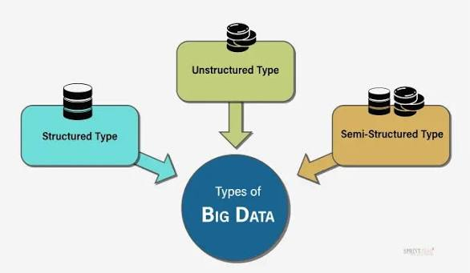
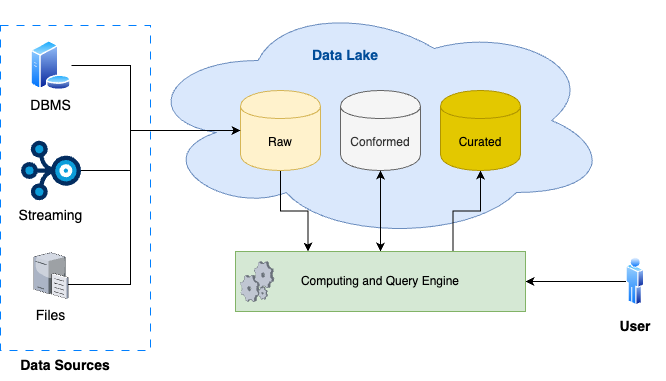
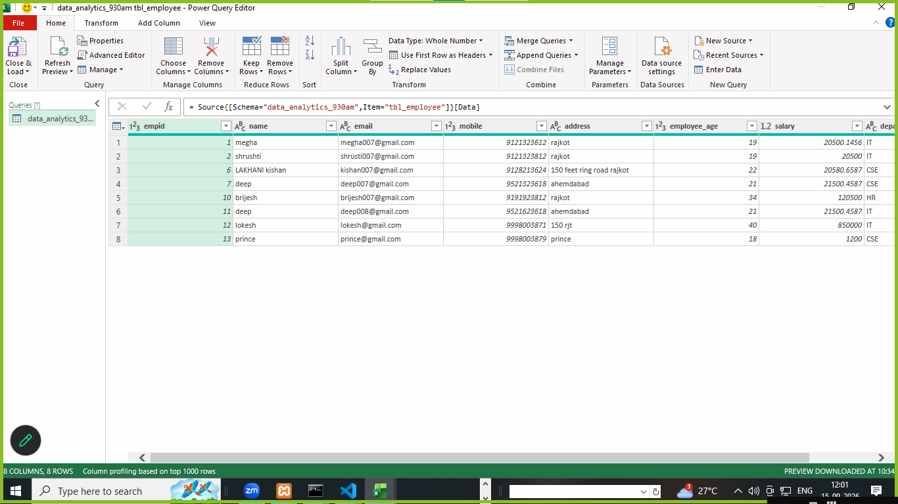

# what is data ?
  
  1. data is collection of information i.e called data
  2. data is many types that are ...

# types of data ? 

  1. structured data 
  2. unstructured data 
  3. raw data 

# architecture of data ?








# structured data ? 

- structured data stored in formate of structured 
- stored data in column and row | column and cell 
- stored data in excel | table | csv(comma separated values)

**examples**

**users**

| id     |   name   |  email     |   phone        |
|--------|----------|------------|----------------|
|1       |mansi     |mansi@gmail.com|91213212121  |
|2       |mansi     |mansi@gmail.com|91213212121  |
|3       |mansi     |mansi@gmail.com|91213212121  |
|4       |mansi     |mansi@gmail.com|91213212121  |
|5       |mansi     |mansi@gmail.com|91213212121  |
|6       |mansi     |mansi@gmail.com|91213212121  |

**excel examples**




# unstructured data ?

- stored data in unstructured formate 
- stored data in text | images | videos | audio etc

**examples**

```
.mp3
.mp4
.txt
.png
.jpg
.jpeg
.gif 

```

# raw  data ?

- stored data in raw formate 
- stored data .json or object formate
- stored data in .json (javascript object notation) or api data

**examples**
```
.json 
or
object 

```

**samples data of json**

```
"user":[
    {
      id:"1",
      name:"rushikesh",
      salary:45800  
    },
    {
      id:"2",
      name:"smit",
      salary:47800  
    },
    {
      id:"3",
      name:"astha",
      salary:46800  
    },
    {
      id:"4",
      name:"mansi",
      salary:47800  
    },
    {
      id:"6",
      name:"ajay",
      salary:48800  
    },
]

```