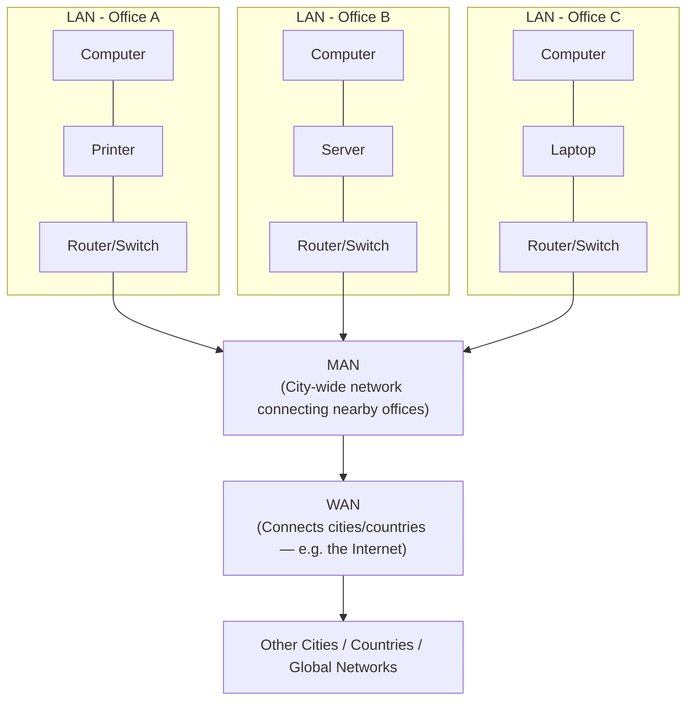

# What is LAN, WAN, and MAN?

Computer networks are classified based on the **geographical area** they cover. The three most common types are **LAN**, **MAN**, and **WAN**.

---

# 1. LAN (Local Area Network)

A **LAN** is a network that connects computers and devices within a small, limited area, such as a single building, office, home, or school campus.

### Key Characteristics
* Covers a small geographical area (a few meters to a few kilometers)
* High data transfer speed
* Low cost to set up and maintain
* Usually owned and managed by a single organization or individual
* Uses **Ethernet cables** or **Wi-Fi** for connectivity

### Examples
* A home network connecting a laptop, phone, and printer
* An office network connecting employee computers
* A computer lab in a school or college

---

# 2. MAN (Metropolitan Area Network)

A **MAN** is a network that spans a larger area than a LAN — typically covering a city or a large campus, connecting multiple LANs together.

### Key Characteristics
* Covers a city or town (larger than a LAN, smaller than a WAN)
* Medium to high data transfer speed
* Often owned by a single organization or a group of organizations (e.g., ISPs, government bodies)
* More expensive to set up than a LAN
* Uses **fiber optic cables** or **microwave links**

### Examples
* Cable TV networks across a city
* A university network connecting multiple campuses in the same city
* City-wide Wi-Fi networks

---

# 3. WAN (Wide Area Network)

A **WAN** is a network that covers a very large geographical area — a country, continent, or even the entire globe. It connects multiple LANs and MANs together.

### Key Characteristics
* Covers very large distances (across cities, countries, or continents)
* Slower than LAN due to distance and infrastructure
* More expensive to build and maintain
* Usually owned by multiple organizations, or uses public/leased infrastructure
* Uses **satellite links, leased telephone lines, or fiber optic backbones**

### Examples
* The **Internet** (the largest WAN in existence)
* A multinational company connecting its offices across different countries
* Bank networks connecting branches across a country

---

# Quick Comparison Table

| Feature | LAN | MAN | WAN |
|---|---|---|---|
| **Full Form** | Local Area Network | Metropolitan Area Network | Wide Area Network |
| **Coverage Area** | Small (building/campus) | Medium (city/town) | Large (country/globe) |
| **Speed** | Very High | High | Comparatively Low |
| **Cost** | Low | Medium | High |
| **Ownership** | Single organization | One or few organizations | Multiple organizations |
| **Example** | Office/home network | City cable network | The Internet |
| **Maintenance** | Easy | Moderate | Difficult |

---

# How They Connect (Architecture)

LANs are the smallest building blocks. Multiple LANs connect to form a MAN, and multiple MANs/LANs connect across long distances to form a WAN.

**How to read this diagram:**

1. Individual devices (computers, printers, servers) connect within a single building to form a **LAN**.
2. Multiple LANs within the same city connect together (often through fiber or leased lines) to form a **MAN**.
3. Multiple MANs and LANs across different cities and countries connect together through long-distance links to form a **WAN** — the Internet being the biggest real-world example.