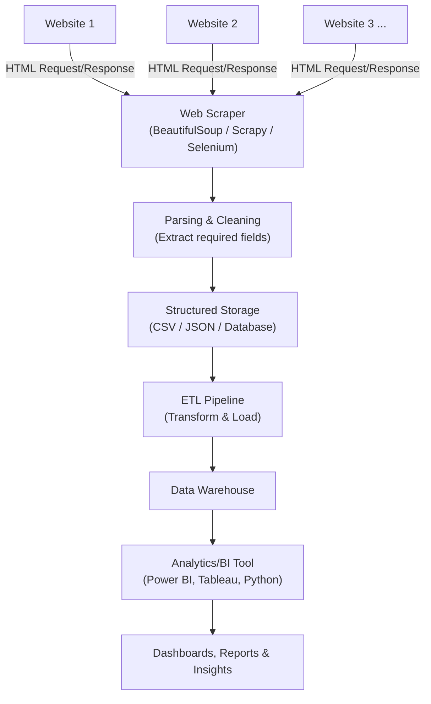

# What is Web Scraping?

**Web scraping** is the automated process of extracting data from websites. Instead of manually copying information from web pages, a **script or tool (scraper)** visits websites, reads their HTML content, and pulls out the required data (text, images, prices, tables, etc.) into a structured format like a spreadsheet or database.

**Data scraping** is a broader term that refers to extracting data from *any* source — not just websites — including PDFs, documents, applications, or screens. Web scraping is essentially a **subset of data scraping**, specifically focused on extracting data from the web.

> **Analogy:** Imagine you need prices of a product from 500 different websites. Doing it manually would take days. A web scraper acts like a robot assistant that visits each page, reads the price, and records it for you — in seconds.

---

# How Web Scraping Works (Basic Steps)

1. **Send a request** to a website's URL (like a browser would)
2. **Receive the HTML** content of the page
3. **Parse the HTML** to locate the required data (using tags, classes, or IDs)
4. **Extract the data** (text, links, tables, images, etc.)
5. **Store the data** in a structured format (CSV, JSON, database, Excel)

---

# Common Tools & Technologies Used

* **Python Libraries** – BeautifulSoup, Scrapy, Selenium
* **Browser Automation** – Selenium, Playwright (for JavaScript-heavy sites)
* **No-Code Tools** – Octoparse, ParseHub, Web Scraper (Chrome extension)
* **APIs (alternative to scraping)** – Some websites provide official APIs to fetch data legally instead of scraping

---

# Examples of Web Scraping Use Cases

* Collecting product prices from e-commerce sites for price comparison
* Extracting job listings from multiple job portals
* Gathering news articles for sentiment analysis
* Collecting real estate listings and property prices
* Monitoring competitor websites for pricing/marketing changes
* Extracting social media posts or reviews for research

---

# Role of Web Scraping & Data Scraping in Data Analytics

Data analytics depends heavily on having enough **relevant, up-to-date data** to analyze. Not all data is available through clean APIs or downloadable files — often, the only way to get it is by scraping it directly from the source. This makes web/data scraping a key **data collection technique** in the analytics workflow.

### 1. Data Collection at Scale
Scraping allows analysts to gather large volumes of data from multiple websites automatically, which would be impossible to do manually within a reasonable time.

### 2. Filling Gaps Where APIs Don't Exist
Many websites don't offer public APIs. Scraping becomes the only practical way to access that data for analysis (e.g., scraping competitor pricing when no API is available).

### 3. Market & Competitor Analysis
Businesses scrape competitor websites to track pricing, product changes, and promotions — feeding this data into dashboards for strategic decision-making.

### 4. Sentiment & Text Analysis
Scraped reviews, social media posts, or news articles are used as input for **Natural Language Processing (NLP)** and sentiment analysis models.

### 5. Building Training Datasets
Machine learning models often require large labeled datasets. Web scraping helps collect real-world data (images, text, prices) to train and validate these models.

### 6. Trend Analysis & Forecasting
Scraped historical data (like stock prices, real estate trends, or search trends) helps analysts identify patterns and build forecasting models.

### 7. Automating Data Pipelines
Scraping scripts can be scheduled to run periodically, automatically feeding fresh data into a data warehouse for continuous, up-to-date analytics.

---

# How Web Scraping Fits Into a Data Analytics Workflow (Architecture)

**How to read this diagram:**

1. A **scraper** sends requests to one or more target **websites** and receives their raw HTML content.
2. The scraper **parses and cleans** the HTML to pull out only the required data fields.
3. The extracted data is saved in a **structured format** (CSV, JSON, or a database table).
4. This data flows through an **ETL pipeline** into a **data warehouse**.
5. Analysts use **BI tools** to query the warehouse and produce **dashboards, reports, and insights** for decision-making.

---

