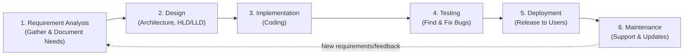

# What is SDLC?

**SDLC** stands for **Software Development Life Cycle**. It is a structured process/framework used by software teams to **design, develop, test, and deploy** high-quality software in a systematic and efficient manner.

SDLC defines a series of well-planned phases that a software project goes through — from the initial idea to the final release and ongoing maintenance — ensuring the software meets requirements, stays within budget, and is delivered on time.

---

# Why is SDLC Important?

* Provides a clear roadmap for the entire development process
* Helps identify and fix issues early, reducing overall cost
* Improves project planning, time estimation, and resource allocation
* Ensures the final product meets client/business requirements
* Improves communication and coordination among team members
* Produces well-documented, maintainable software

---

# Phases of SDLC

SDLC typically consists of **six to seven phases**, each with a specific goal and deliverable.

## 1. Requirement Analysis (Planning)

This is the first and most important phase. The team gathers requirements from stakeholders/clients to understand what the software should do.

**Activities:**
* Understanding business needs and goals
* Gathering functional and non-functional requirements
* Feasibility study (technical, financial, and time feasibility)
* Creating a project plan and timeline

**Output:** Software Requirement Specification (SRS) document

---

## 2. Design

In this phase, the overall **architecture and design** of the software is planned based on the requirements gathered.

**Activities:**
* Creating high-level design (HLD) – overall system architecture
* Creating low-level design (LLD) – detailed design of individual components/modules
* Designing database schema, UI/UX layouts, and system architecture
* Choosing technology stack

**Output:** Design documents (HLD, LLD), architecture diagrams

---

## 3. Implementation (Coding)

Developers begin writing the actual **source code** based on the design documents, using the chosen programming languages and tools.

**Activities:**
* Writing code according to design specifications
* Following coding standards and best practices
* Code reviews and version control (Git, etc.)
* Unit-level testing by developers

**Output:** Working software modules/components

---

## 4. Testing

Once coding is complete, the software is thoroughly tested to identify and fix bugs before release.

**Activities:**
* Functional testing (does it work as expected?)
* Integration testing (do modules work together correctly?)
* Performance testing (speed, load handling)
* Security testing
* User Acceptance Testing (UAT)

**Output:** Bug-free, tested software ready for deployment

---

## 5. Deployment

The tested software is released and made available to end users, either in stages or all at once.

**Activities:**
* Deploying to production servers/environment
* Configuring the live environment
* Data migration (if applicable)
* Releasing to a small group first (beta release) or full rollout

**Output:** Live, functioning software available to users

---

## 6. Maintenance

After deployment, the software requires ongoing **support and updates** to fix issues, improve performance, and add new features over time.

**Activities:**
* Fixing bugs reported by users
* Releasing patches and updates
* Adding new features based on user feedback
* Monitoring performance and security

**Output:** Continuously improved, stable, up-to-date software

---

---

# SDLC Process Flow (Architecture)

**How to read this diagram:**

1. The cycle starts with **Requirement Analysis**, understanding what needs to be built.
2. Moves into **Design**, where the architecture and structure are planned.
3. Developers move to **Implementation**, writing the actual code.
4. The software is put through **Testing** to catch and fix defects.
5. Once stable, it goes into **Deployment**, becoming available to real users.
6. **Maintenance** keeps the software running smoothly, fixing issues and adding improvements — which often leads back into a new round of **Requirement Analysis** for future updates (making it a *cycle*, not just a one-time process).

---

# Common SDLC Models

SDLC phases can be organized in different ways depending on the project needs:

* **Waterfall Model** – Phases completed one after another in strict sequence
* **Agile Model** – Iterative, phases repeat in short cycles (sprints)
* **V-Model** – Testing planned alongside each development phase
* **Spiral Model** – Combines iterative development with risk analysis
* **Iterative Model** – Software built in repeated cycles, improving each time