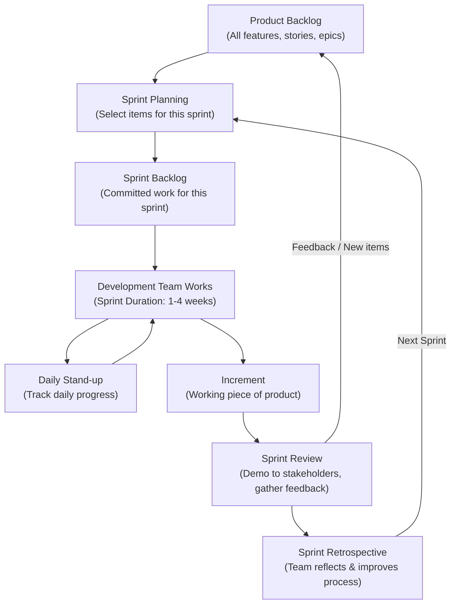

# What is Agile Methodology?

**Agile** is a project management and software development methodology based on **iterative, incremental development**, where requirements and solutions evolve through collaboration between self-organizing, cross-functional teams. Instead of building an entire product in one long cycle (like Waterfall), Agile breaks the work into **small, manageable chunks** delivered in short, repeated cycles.

The core idea of Agile is to **deliver working software frequently**, adapt quickly to changes, and continuously improve based on feedback from customers and stakeholders.

Agile was formalized in **2001** through the **Agile Manifesto**, created by a group of software developers who wanted a more flexible, people-focused alternative to traditional, rigid development processes.

---

# The Agile Manifesto — 4 Core Values

Agile is built on **4 fundamental values**:

1. **Individuals and interactions** over processes and tools
2. **Working software** over comprehensive documentation
3. **Customer collaboration** over contract negotiation
4. **Responding to change** over following a fixed plan

---

# The 12 Principles Behind Agile

1. Customer satisfaction through early and continuous delivery of software
2. Welcome changing requirements, even late in development
3. Deliver working software frequently (weeks, not months)
4. Business people and developers must work together daily
5. Build projects around motivated individuals and trust them
6. Face-to-face conversation is the most effective communication
7. Working software is the primary measure of progress
8. Agile promotes sustainable development at a constant pace
9. Continuous attention to technical excellence and good design
10. Simplicity — maximizing the amount of work *not* done
11. Best results come from self-organizing teams
12. Regular reflection on how to become more effective, then adjusting

---

# Key Terms in Agile Methodology

Agile has its own vocabulary. Here are the essential terms explained:

### 1. Sprint
A **fixed, short time period** (usually 1–4 weeks) during which a specific set of work is completed and made ready for review. Sprints are the "heartbeat" of Agile — work is planned, executed, and reviewed sprint by sprint.

### 2. Backlog (Product Backlog)
A prioritized list of **all the features, tasks, bug fixes, and requirements** for a project. It's a living document that's continuously updated as the project evolves.

### 3. Sprint Backlog
A subset of items pulled from the Product Backlog that the team commits to completing **within one specific sprint**.

### 4. User Story
A short, simple description of a feature written from the end user's perspective, usually in the format:
> *"As a [type of user], I want [goal] so that [reason/benefit]."*

### 5. Epic
A **large body of work** that can be broken down into multiple smaller user stories. Epics represent bigger goals or features that span several sprints.

### 6. Scrum
The most popular **framework** for implementing Agile. Scrum organizes work into sprints and defines specific roles, meetings, and artifacts to structure the process.

### 7. Kanban
Another Agile framework that visualizes work using a **board with columns** (e.g., To Do, In Progress, Done) and focuses on continuous flow rather than fixed sprints.

### 8. Scrum Master
The person responsible for **facilitating the Scrum process**, removing obstacles/blockers for the team, and ensuring Agile principles are followed. They are a coach, not a manager.

### 9. Product Owner
The person responsible for **defining and prioritizing the product backlog**, representing the customer/stakeholder's interests, and deciding what gets built and in what order.

### 10. Development Team
The **cross-functional group** of people (developers, designers, testers) who actually build the product during each sprint.

### 11. Daily Stand-up (Daily Scrum)
A short (usually 15-minute) daily meeting where team members share:
* What they did yesterday
* What they plan to do today
* Any blockers/obstacles they're facing

### 12. Sprint Planning
A meeting held at the **start of a sprint** where the team decides which backlog items to work on and how to accomplish them.

### 13. Sprint Review
A meeting held at the **end of a sprint** where the team demonstrates completed work to stakeholders and gathers feedback.

### 14. Sprint Retrospective
A meeting held after the Sprint Review where the team reflects on **what went well, what didn't, and how to improve** in the next sprint.

### 15. Velocity
A measure of how much work a team completes during a sprint, usually measured in **story points**. Used to predict how much work can be done in future sprints.

### 16. Story Points
A unit used to estimate the **relative effort/complexity** of a user story, rather than estimating exact hours or days.

### 17. Burndown Chart
A visual chart showing **how much work remains** versus time in a sprint, helping teams track progress and identify if they're on schedule.

### 18. MVP (Minimum Viable Product)
The simplest version of a product that includes just enough features to be usable and to gather feedback from real users.

### 19. Definition of Done (DoD)
A shared understanding among the team of what "**complete**" means for any given task or user story (e.g., coded, tested, reviewed, documented).

### 20. Increment
The sum of all completed backlog items at the end of a sprint — the actual **working piece of product** delivered.

---

# Agile Roles Summary

| Role | Responsibility |
|---|---|
| **Product Owner** | Defines what to build; manages and prioritizes the backlog |
| **Scrum Master** | Facilitates the process; removes blockers; ensures Agile practices |
| **Development Team** | Builds the actual product during each sprint |

---

# Agile Workflow (Architecture)

**How to read this diagram:**

1. Everything starts with the **Product Backlog** — the full list of what needs to be built.
2. During **Sprint Planning**, the team selects a set of items to become the **Sprint Backlog**.
3. The **Development Team** works on these items for the length of the sprint, syncing daily via **Daily Stand-ups**.
4. At the end of the sprint, a working **Increment** of the product is produced.
5. The **Sprint Review** showcases this increment to stakeholders and gathers feedback (which may add new items back into the Product Backlog).
6. The **Sprint Retrospective** lets the team reflect on their process and improve before starting the **next sprint** — and the cycle repeats.

---

