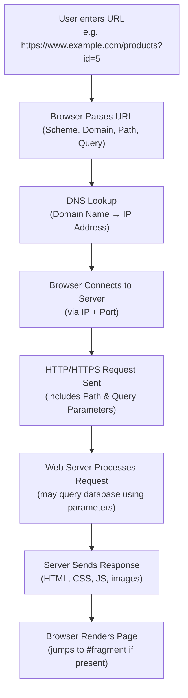

# What is a URL?

**URL** stands for **Uniform Resource Locator**. It is the **web address** used to locate and access a specific resource (web page, image, file, video, etc.) on the Internet.

A URL tells a browser exactly **where** a resource is located and **how** to retrieve it (which protocol to use).

> **Example:** `https://www.example.com/products/shoes?color=red#reviews`

---

# Structure (Parts) of a URL

A URL is made up of several components, each serving a specific purpose:

| Part | Example | Description |
|---|---|---|
| **Scheme/Protocol** | `https://` | Defines how data is transferred (HTTP, HTTPS, FTP, etc.) |
| **Subdomain** | `www.` | An optional prefix pointing to a specific section of a domain |
| **Domain Name** | `example.com` | The main address/name of the website |
| **Port** | `:8080` | Specifies which "door" on the server to connect to (often hidden/default) |
| **Path** | `/products/shoes` | The specific location of the resource on the server |
| **Query Parameters** | `?color=red` | Extra data sent to the server (key-value pairs) |
| **Fragment/Anchor** | `#reviews` | Points to a specific section within the page |

---

# Types of URLs

URLs can be classified in several ways — by structure, by protocol used, and by purpose.

## 1. Based on Structure

### Absolute URL
Contains the **complete address** of a resource, including the protocol and domain name. It works independently, from anywhere.

**Example:** `https://www.example.com/images/logo.png`

### Relative URL
Contains only the **path** to a resource, relative to the current page's location. It only works within the context of the current website.

**Example:** `/images/logo.png` (used inside `example.com`)

---

## 2. Based on Protocol (Scheme)

### HTTP URL
Uses the **HTTP (HyperText Transfer Protocol)** — standard, unencrypted web communication.

**Example:** `http://example.com`

### HTTPS URL
Uses **HTTPS (HTTP Secure)** — encrypted version of HTTP using SSL/TLS, ensuring secure data transfer.

**Example:** `https://example.com`

### FTP URL
Used for transferring files via **FTP (File Transfer Protocol)**.

**Example:** `ftp://files.example.com/document.pdf`

### Mailto URL
Used to open the default email client with a pre-filled recipient address.

**Example:** `mailto:someone@example.com`

### Tel URL
Used to trigger a phone call from a device (mainly on mobile).

**Example:** `tel:+911234567890`

### File URL
Used to access a file stored **locally** on a computer, rather than on the web.

**Example:** `file:///C:/Users/Documents/report.pdf`

---

## 3. Based on Purpose/Usage

### Canonical URL
The **preferred/original URL** of a page, used to avoid duplicate content issues in search engines when the same content is accessible through multiple URLs.

### Dynamic URL
A URL generated **on the fly** based on user input or database queries, often containing parameters (`?id=123&sort=asc`). Common in e-commerce and search results.

### Static URL
A **fixed URL** that doesn't change and doesn't rely on query parameters — usually cleaner and more SEO-friendly.

**Example:** `https://example.com/about-us` (static) vs `https://example.com/page.php?id=45` (dynamic)

### Vanity URL
A **custom, short, and memorable URL** created for branding or marketing purposes, often using a shortened domain.

**Example:** `bit.ly/company-promo`

### Redirect URL
A URL that automatically **forwards** the user to a different URL (often used when a page has moved).

---

# Architecture: How a URL Works

When a URL is entered into a browser, it goes through a defined process to fetch and display the requested resource.

**How to read this diagram:**

1. The **URL is parsed** by the browser into its individual components (scheme, domain, path, query, fragment).
2. A **DNS lookup** converts the domain name into an IP address.
3. The browser **connects** to the web server at that IP address (using the specified port).
4. An **HTTP/HTTPS request** is sent, including the path and any query parameters.
5. The **server processes** the request — possibly querying a database if parameters are involved — and sends back a response.
6. The browser **renders** the page, and if a fragment (`#section`) is present, scrolls directly to that section.

---

