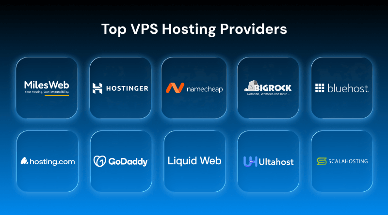

 # What Is Web Hosting?

 ## Definition

 **Web hosting** is a service that stores a website's files on an internet-connected server and makes those files available to visitors through a domain name or IP address.

 A website usually contains files such as HTML, CSS, JavaScript, images, videos, and databases. When a visitor enters a website address in a browser, the browser requests these files from the hosting server. The server then sends the files back so the website can be displayed.

 ## How Web Hosting Works

 1. A website owner creates website files and uploads them to a hosting server.
 2. The domain name is connected to the server using DNS settings.
 3. A visitor enters the domain name in a web browser.
 4. DNS finds the correct hosting server.
 5. The server sends the website files to the visitor's browser.

 ## Important Features of Web Hosting

 - **Storage:** Space for website files, images, videos, and databases.
 - **Bandwidth:** The amount of data the server can transfer to visitors.
 - **Uptime:** The percentage of time the website remains available.
 - **Security:** Features such as SSL certificates, firewalls, malware scanning, and backups.
 - **Control panel:** A dashboard used to manage files, domains, email accounts, and databases.
 - **Technical support:** Help with server and hosting problems.
 - **Scalability:** The ability to increase resources as website traffic grows.

 ## Types of Web Hosting

 ### 1. Shared Hosting

 In shared hosting, many websites use the same physical server and share its resources, such as CPU, memory, and storage.

 **Advantages:**

 - Low cost
 - Easy to set up
 - Suitable for beginners and small websites

 **Disadvantages:**

 - Performance may decrease when other websites use many resources.
 - Customization and server control are limited.
 - It is less suitable for websites with heavy traffic.

 **Best for:** Personal blogs, portfolios, small business websites, and simple informational websites.

 ### 2. VPS Hosting

 VPS stands for **Virtual Private Server**. One physical server is divided into multiple virtual servers. Each VPS receives an allocated amount of CPU, memory, storage, and other resources.

 **Advantages:**

 - Better performance than shared hosting
 - More control and customization
 - Resources are more isolated from other users
 - Can handle moderate traffic

 **Disadvantages:**

 - More expensive than shared hosting
 - Requires some technical knowledge, especially with an unmanaged VPS

 **Best for:** Growing websites, online stores, web applications, and developers who need more control.

 ### 3. Dedicated Hosting

 In dedicated hosting, an entire physical server is assigned to one customer or organization.

 **Advantages:**

 - High performance
 - Full control over server configuration
 - Stronger isolation and customization
 - Suitable for high-traffic websites

 **Disadvantages:**

 - High cost
 - Server administration and security may be the customer's responsibility

 **Best for:** Large businesses, high-traffic websites, enterprise applications, and websites with demanding workloads.

 ### 4. Cloud Hosting

 Cloud hosting uses a network of connected servers instead of relying on only one physical server. Website resources can be distributed across this network.

 **Advantages:**

 - Highly scalable
 - Good reliability because another server may continue working if one server fails
 - Flexible pricing and resource allocation
 - Suitable for changing or unpredictable traffic

 **Disadvantages:**

 - Pricing can be difficult to predict when resource usage changes.
 - Configuration may be more complex than shared hosting.

 **Best for:** Growing businesses, modern web applications, e-commerce websites, and websites with variable traffic.

 ### 5. Managed Hosting

 In managed hosting, the hosting provider handles technical tasks such as server updates, security, backups, monitoring, and performance management. Managed hosting can be offered with VPS, cloud, or dedicated servers.

 **Advantages:**

 - Less server administration for the customer
 - Professional maintenance and monitoring
 - Useful for people without advanced technical skills

 **Disadvantages:**

 - More expensive than unmanaged hosting
 - Some server settings may be restricted

 **Best for:** Businesses and website owners who want to focus on their website instead of server maintenance.

 ### 6. WordPress Hosting

 WordPress hosting is optimized for websites built with WordPress. It may include WordPress installation, automatic updates, caching, backups, and specialized support.

 **Advantages:**

 - Easy WordPress setup
 - WordPress-specific performance and security features
 - Helpful support for WordPress problems

 **Disadvantages:**

 - May be less flexible for non-WordPress applications
 - Some plans restrict plugins or server settings

 **Best for:** Blogs, content websites, portfolios, and businesses using WordPress.

 ### 7. Reseller Hosting

 Reseller hosting allows a person or company to purchase hosting resources and resell them to its own customers under its own brand.

 **Advantages:**

 - Useful for starting a small hosting business
 - Allows management of multiple customer websites
 - Usually includes tools for creating separate hosting accounts

 **Disadvantages:**

 - The reseller depends on the main hosting provider.
 - Customer support and resource management become the reseller's responsibility.

 **Best for:** Web designers, developers, agencies, and people who want to sell hosting services.

 ### 8. Colocation Hosting

 In colocation hosting, a customer owns the server hardware but places it in a professional data center. The data center provides internet connectivity, electricity, cooling, and physical security.

 **Advantages:**

 - Full ownership and control of the hardware
 - Professional data-center infrastructure
 - Reliable power and network connections

 **Disadvantages:**

 - High initial cost
 - The customer is responsible for server hardware and software maintenance

 **Best for:** Organizations that need complete hardware control and have their own technical team.

 ## Web Hosting Comparison

 | Hosting type | Cost | Control | Performance | Suitable for |
 |---|---|---|---|---|
 | Shared | Low | Low | Basic | Small websites and beginners |
 | VPS | Medium | High | Good | Growing websites and applications |
 | Dedicated | High | Very high | Very high | Large, high-traffic websites |
 | Cloud | Variable | High | Scalable | Variable or rapidly growing traffic |
 | Managed | Medium to high | Provider-managed | Depends on plan | Businesses wanting technical support |
 | WordPress | Low to medium | WordPress-focused | Optimized for WordPress | WordPress websites |
 | Reseller | Medium | Account-level | Depends on provider | Agencies and hosting sellers |
 | Colocation | High | Very high | Very high | Organizations owning server hardware |

 ## How to Choose Web Hosting

 Consider the following questions before selecting a hosting plan:

 1. What type of website will be hosted?
 2. How many visitors are expected?
 3. What storage and bandwidth are required?
 4. Is a database or special software needed?
 5. How much technical control is required?
 6. Is managed support important?
 7. Does the provider offer backups, SSL, security, and reliable uptime?
 8. Can the plan be upgraded as traffic increases?

# paid hosting providers

## Conclusion

 Web hosting provides the server space and services needed to publish a website on the internet. Shared hosting is generally the most affordable option for beginners, while VPS, dedicated, and cloud hosting provide more control, performance, or scalability. The best hosting type depends on the website's traffic, budget, technical requirements, and expected growth.