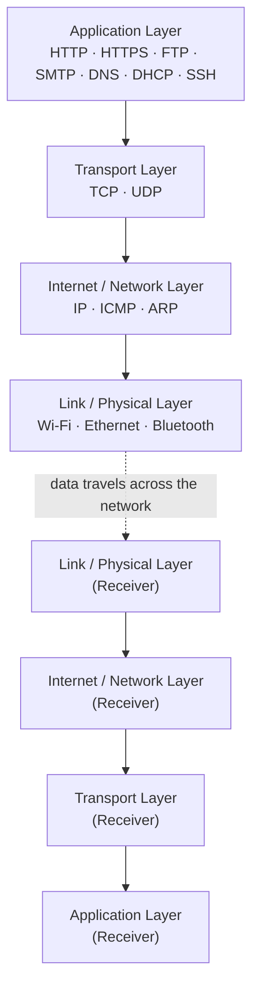

# What is a Protocol?

A **protocol** is a set of rules and standards that define how data is formatted, transmitted, and received between devices on a **network**, so that different systems can understand each other and communicate correctly.

A protocol works like a common language. Just as two people need to speak the same language and follow conversational norms to understand each other, two computers need a protocol to exchange data meaningfully — no matter what hardware, operating system, or software they use.

### Examples

* **HTTP/HTTPS** – Used for browsing websites
* **FTP** – Used for transferring files
* **SMTP** – Used for sending emails
* **TCP/IP** – Used as the foundation of internet communication
* **DNS** – Used for translating domain names into IP addresses

--- 

# What Does a Protocol Define?

A protocol typically defines the following:

### 1. Format
How the data is structured, including **headers**, **packets**, and the overall data layout.

### 2. Timing
When data should be sent, and how fast it can be transmitted.

### 3. Sequencing
The order in which data pieces are sent, received, and reassembled.

### 4. Error Handling
What happens if data is lost, corrupted, delayed, or arrives out of order.

### 5. Connection Setup/Teardown
How a connection is established between devices and how it is properly closed after communication ends.

---

# A Simple Analogy

When you make a phone call, you naturally follow a protocol-like process:

1. You dial a number *(addressing)*
2. The other person says "Hello" *(connection establishment)*
3. You take turns speaking *(data transmission rules)*
4. You say "Bye" before hanging up *(connection termination)*

Network protocols work the same way. For example, **TCP** establishes a connection, reliably sends data in the correct order, and then closes the connection properly — just like a phone call.

---

# Protocol Architecture (TCP/IP Layered Model)

Protocols don't work in isolation — they are organized in **layers**. Each layer has a specific job and uses the protocols below it to do its work. Data from an application travels down through the layers on the sender's side, across the network, then back up through the layers on the receiver's side.

**How to read this diagram:**

* Each layer only talks to the layer directly above or below it.
* The **Application Layer** is what the user/software directly works with (e.g., a browser using HTTP).
* The **Transport Layer** (TCP/UDP) breaks data into segments and manages delivery.
* The **Internet Layer** (IP) handles addressing and routing across networks.
* The **Link/Physical Layer** handles the actual physical transmission (cables, Wi-Fi signals, etc.).
* On the receiving device, the same layers work in reverse to reassemble the original data.

---

# Types of Protocols

Protocols can be classified according to the **layer** they operate at or the **function** they perform.

## 1. Network/Internet Layer Protocols

These protocols handle addressing and routing of data across networks.

* **IP (Internet Protocol)** – Addresses and routes data packets (IPv4, IPv6)
* **ICMP** – Used for error reporting and diagnostics (e.g., `ping`)
* **ARP** – Maps IP addresses to MAC addresses
* **RIP, OSPF, BGP** – Used for routing data between networks

---

## 2. Transport Layer Protocols

These protocols manage how data is transported between devices.

* **TCP (Transmission Control Protocol)** – Reliable, connection-oriented communication
* **UDP (User Datagram Protocol)** – Fast, connectionless communication with no delivery guarantee

**Common uses:**

* TCP – Web browsing, email, file transfer
* UDP – Video streaming, online gaming, voice calls

---

## 3. Application Layer Protocols

These protocols are used directly by applications to communicate over a network.

* **HTTP/HTTPS** – Web browsing (HTTPS is the secure version)
* **FTP/SFTP** – File transfer
* **SMTP, POP3, IMAP** – Sending and receiving email
* **DNS** – Translates domain names into IP addresses
* **DHCP** – Automatically assigns IP addresses to devices
* **Telnet/SSH** – Remote login (SSH is the secure version)
* **SNMP** – Network device management
* **NTP** – Time synchronization across devices

---

## 4. Security Protocols

These protocols protect data during transmission.

* **SSL/TLS** – Encrypts data in transit
* **IPSec** – Secures IP communications, commonly used in VPNs
* **SSH** – Provides secure remote access
* **WPA/WPA2/WPA3** – Secures wireless networks

---

## 5. Email Protocols

These protocols manage sending, receiving, and syncing emails.

* **SMTP** – Sends outgoing mail
* **POP3** – Downloads mail (usually removes it from the server)
* **IMAP** – Syncs mail across multiple devices

---

## 6. Wireless/Communication Protocols

These protocols enable wireless communication between devices.

* **Wi-Fi (802.11)**
* **Bluetooth**
* **NFC (Near Field Communication)**
* **Zigbee** – Commonly used in IoT devices
* **LTE/5G** – Mobile network communication

---

## 7. File Transfer/Sharing Protocols

These protocols are used to transfer or share files between systems.

* **FTP/FTPS/SFTP**
* **SMB (Server Message Block)** – Used for file sharing in Windows
* **NFS (Network File System)** – Used for file sharing in Unix/Linux

---

## 8. Routing Protocols

These protocols are used by routers to determine the best path for data.

* **RIP** – Simple, distance-vector based routing
* **OSPF** – Link-state routing with faster convergence
* **BGP** – Used for routing between large networks, including the internet backbone

---

# Protocols and the OSI/TCP-IP Model

Most protocols operate at a specific layer of the **OSI model** (7 layers) or the simpler **TCP/IP model** (4 layers):

* **Application Layer** – HTTP, FTP, SMTP, DNS
* **Transport Layer** – TCP, UDP
* **Internet/Network Layer** – IP, ICMP, ARP
* **Link/Physical Layer** – Wi-Fi, Ethernet, Bluetooth

Understanding which layer a protocol belongs to helps explain exactly what job it performs in the overall communication process.