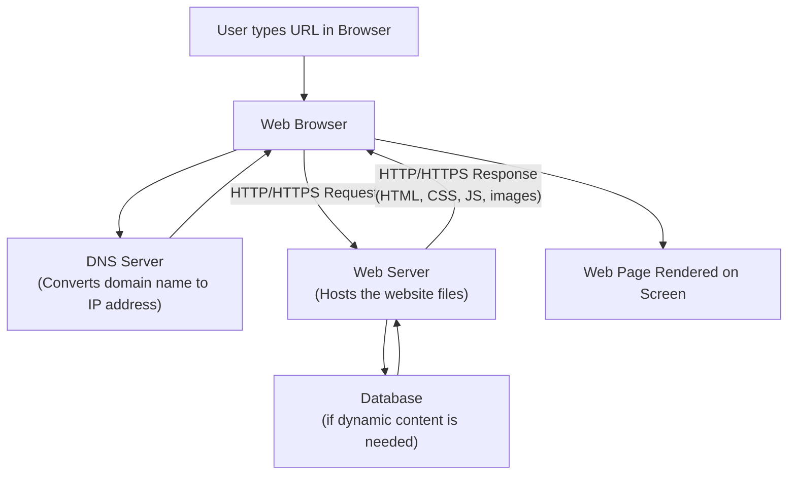

# What is WWW (World Wide Web)?

The **World Wide Web (WWW)**, commonly known as the **Web**, is a system of interlinked documents, web pages, and resources that can be accessed over the **Internet** using a **web browser**.

It was invented by **Tim Berners-Lee** in 1989. The WWW allows users to view text, images, videos, and other multimedia content, and to navigate between pages using **hyperlinks**.

---

# Key Components of WWW

### 1. Web Pages
Documents (usually written in **HTML**) that are displayed in a browser.

### 2. Web Browser
Software used to access and display web pages, such as Chrome, Firefox, Safari, or Edge.

### 3. Web Server
A computer that stores websites and delivers web pages to browsers when requested.

### 4. URL (Uniform Resource Locator)
The address used to locate a resource on the web, e.g., `https://www.example.com`.

### 5. HTTP/HTTPS
The protocol used to transfer web pages between the server and the browser (HTTPS is the secure version).

### 6. Hyperlinks
Clickable links that connect one web page to another.

---

# Uses of WWW

The WWW is used for a wide range of purposes, including:

* **Information Access** – Searching and reading articles, news, research papers, and educational content
* **Communication** – Email, messaging, video calls, and social media
* **E-Commerce** – Online shopping, banking, and digital payments
* **Entertainment** – Streaming videos, music, games, and online media
* **Education** – Online courses, tutorials, and e-learning platforms
* **Business** – Company websites, marketing, advertising, and remote work tools
* **Government Services** – Applying for documents, paying taxes, and accessing public information
* **Cloud Services** – Storing and accessing files/data online (Google Drive, Dropbox, etc.)
* **Social Networking** – Connecting and interacting with people (Facebook, Instagram, LinkedIn)

---

# How WWW Works (Architecture)

When you type a URL into a browser and press Enter, several steps happen behind the scenes before the web page appears on your screen.

**Step-by-step explanation:**

1. **User enters a URL** (e.g., `www.example.com`) in the browser.
2. The browser sends the domain name to a **DNS Server**, which translates it into the website's **IP address**.
3. The browser sends an **HTTP/HTTPS request** to the **Web Server** at that IP address.
4. If the page needs dynamic content (like user data), the web server communicates with a **Database** to fetch the required information.
5. The web server sends back an **HTTP/HTTPS response**, containing the HTML, CSS, JavaScript, and other resources.
6. The browser **renders** this response and displays the final web page to the user.

---
