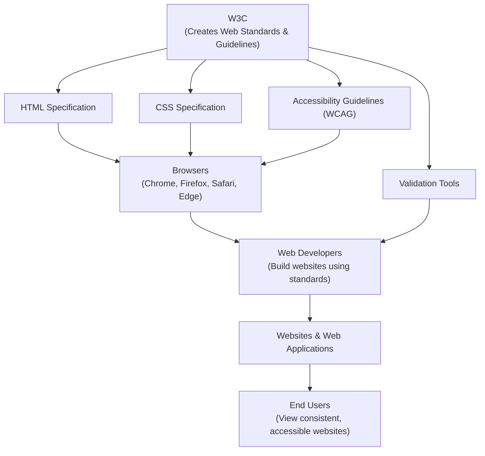

# What is W3C?

**W3C (World Wide Web Consortium)** is an international organization that develops and maintains **standards and guidelines** for the World Wide Web, ensuring that websites and web technologies work consistently across different browsers, devices, and platforms.

It was founded in **1994 by Tim Berners-Lee** (the inventor of the WWW), and is currently led by a consortium of member organizations, staff, and the public, working together to create open standards for the Web.

> **In short:** W3C doesn't build websites or browsers itself — it creates the **rules and standards** (like HTML, CSS specifications) that browsers and developers follow so the web works the same way for everyone.

---

# Why Was W3C Created?

Before standardization, different browsers interpreted web code differently, which caused:

* Websites looking different (or breaking) in different browsers
* Compatibility issues across devices
* Confusion for developers on which "version" of HTML/CSS to use

W3C was created to solve this by publishing **official, agreed-upon standards** that all browsers and developers can follow.

---

# What Does W3C Do?

### 1. Develops Web Standards
Creates and publishes specifications for technologies like:

* **HTML** – Structure of web pages
* **CSS** – Styling and layout
* **XML** – Data structuring
* **SVG** – Scalable vector graphics
* **WAI-ARIA** – Web accessibility

### 2. Ensures Accessibility
Publishes guidelines (like **WCAG** – Web Content Accessibility Guidelines) so websites can be used by people with disabilities.

### 3. Promotes Interoperability
Makes sure that a website built following W3C standards works correctly across **all browsers and devices**, not just one.

### 4. Validates Web Code
Provides free tools like the **W3C Markup Validation Service** to check if HTML/CSS code follows official standards.

### 5. Guides Future Web Technologies
Researches and standardizes emerging web technologies (e.g., Web Assembly, Web of Things, Web Payments).

---

# Uses of W3C

W3C standards and services are used for:

* **Web Development** – Following correct HTML/CSS syntax for cross-browser compatibility
* **Code Validation** – Checking websites for errors using the W3C Validator
* **Accessibility Compliance** – Making websites usable for people with disabilities (WCAG standards)
* **SEO & Best Practices** – Search engines favor well-structured, standards-compliant code
* **Browser Development** – Browser companies (Chrome, Firefox, Safari) build their engines based on W3C specifications
* **Learning Resources** – W3Schools and official W3C documentation help developers learn correct web standards
* **Internationalization** – Ensuring websites work correctly across different languages and regions

---

# How W3C Fits Into the Web (Architecture)

W3C sits at the center of the web ecosystem — it doesn't build products directly, but its standards influence everyone who builds or uses the web.

**How to read this diagram:**

1. **W3C** researches and publishes official **standards** (HTML, CSS, accessibility guidelines, etc.).
2. **Browser makers** (Chrome, Firefox, Safari, Edge) implement these standards into their rendering engines.
3. **Developers** write code following these standards, and use **W3C validation tools** to check correctness.
4. The resulting **websites** then render consistently across all browsers.
5. **End users** benefit from websites that look and work the same everywhere, and are accessible to everyone.

---
