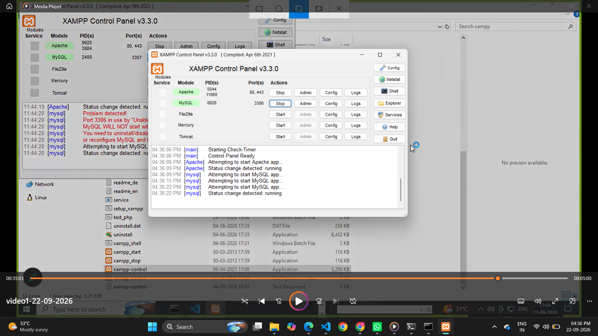
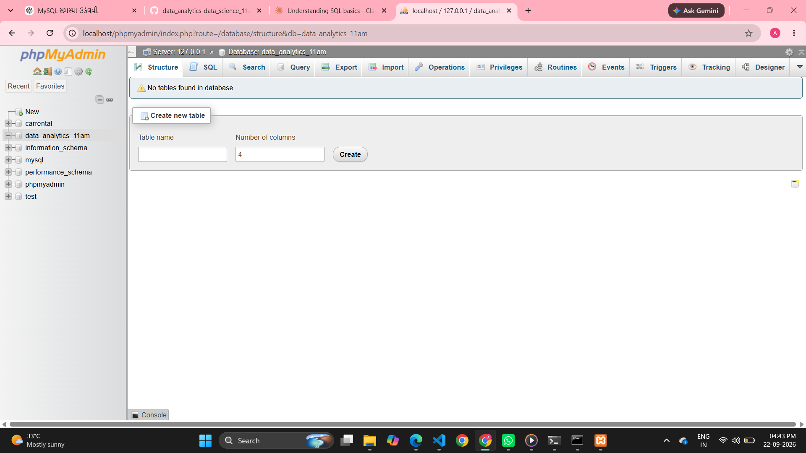
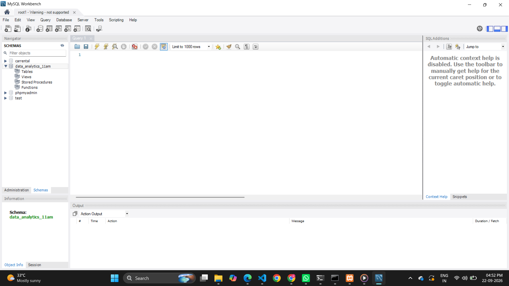
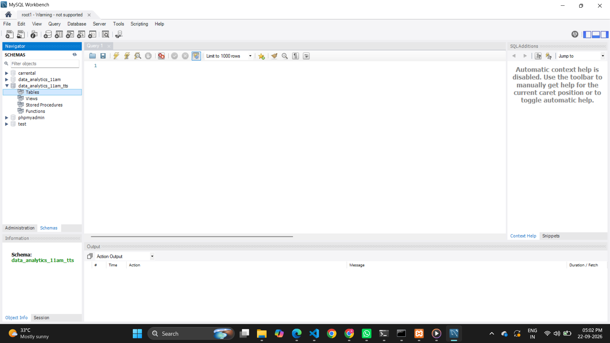

## Database Management System (DBMS)

A DBMS is software used to create, manage, and access a database.

Examples:

- MySQL
- Oracle
- PostgreSQL
- MongoDB

It helps users:
- create databases
- insert data
- update data
- query data
- secure data

---

## Basic database concepts

### Table
A table is a collection of related data.

Example:
Student table:
- StudentID
- Name
- Age
- City

### Row
A single record in a table.

### Column
A field/attribute in a table.

### Primary Key
A unique identifier for each record.

Example:
StudentID

### Query
A request to fetch or manipulate data.

Example:
SELECT * FROM Students;

---

## Example of a table

Student table:

| StudentID | Name | Age | City |
|----------|------|-----|------|
| 101 | Aisha | 20 | Lahore |
| 102 | Ahmed | 21 | Karachi |
| 103 | Sara | 19 | Islamabad |

This is how database data is stored in a structured way.

---


# RDBMS (relational database management system)

### 1. Relational Database

Stores data in tables with rows and columns.

Example:
- Students table
- Courses table
- Marks table
- employees table 
- products table


Popular DBMS ( database management systems):

- MySQL
- PostgreSQL
- Oracle
- SQL Server
- IBM
- sqlite 


### 2. Non-Relational Database
Stores data in formats like JSON, key-value, documents, graphs, etc.

Examples:
- MongoDB (noSQL)
- Cassandra
- Redis


# installations of database ? 
# xampp 

1. open xampp control
2. start server & mysql
3. open broswers 
4. localhost/phpmyadmin



# how to create a database 
```
create database databasename
or
create database data_analytics_11am

```


# mysqlworkbench8.0

1. open mysqlworkbench8.0
2. create new database instance 
3. setup all 
4. select schema 
5. your database should be visible 


or


