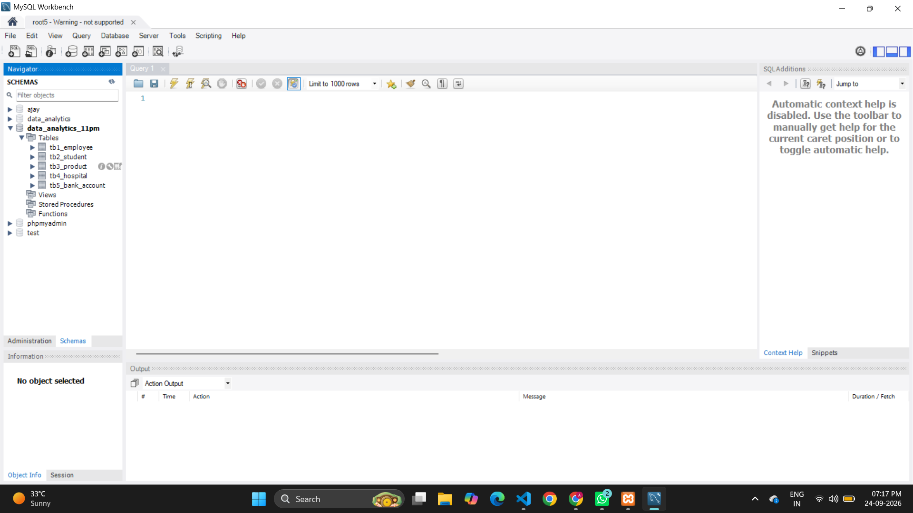

# what is SQL ?

1. SQL stands for **structured query language**
2. SQL used for create database | tables structured  
3. SQL is a case insenstive query language
**examples**
```
insert | INSERT | Insert
```
4. SQL is used to create structured of database and tables via its **query or command**
5. SQL is create logics and functional
6. SQL execute query 
7. SQL create views or index to fast load data 
8. SQL create a structured data 

**structured data formate column and rows**
**examples**

|   id      |   name       |     age     |    address     |
|-----------|--------------|-------------|----------------|
|  1        |    Ajay      |     25      |    rjt         |
|  2        |    axay      |     25      |    rjt         |
|  3        |    mansi     |     25      |    rjt         |
|  4        |    bansi     |     25      |    rjt         |
|  5        |    prince    |     25      |    rjt         |  


# types of SQL query or commands 

1. **DDL (data definition language)**
2. **DML (data manipulation language)**
3. **DQL (data query language)**
4. **TCL (transactional control language)**


# DDL (data definition language)

1. stands for data definition language
2. create an structured of database and tables 
3. rename tables 
4. update | add | modify | drop data in tables or columns in tables 
5. truncate data from tables 

**DDL query are**

1. create 
2. alter 
3. rename 
4. drop 
5. truncate 
6. change 

# how to create database and table structured 

1. create a database 

**syntax**

```
create database databasename;
```

**examples**

```
create database data_analytics_11am
```

2. create a table  structured

**syntax**

```
create table tablename
(
id datatype (size) auto_increment primary key,
columnname datatype (size),
.
.
.
.
.
.
columnname datatype(size)
);

```

**examples**

```
create table tbl_employee(
empid int AUTO_INCREMENT primary key,
name varchar(255),
age int,    
address text, 
salary decimal(10,2),
city varchar(100),
department varchar(200)   
);

```

# what is datatypes and size of column name is tables 

| Column / Field | Data Type | Description |
|---|---|---|
| name | CHAR(0–255) | Stores fixed-length character/string data. Intended for characters/text only. |
| name | VARCHAR(0–255) | Stores variable-length character/string data. Can contain letters, numbers, spaces, and special characters. |
| id | INT | Stores whole numbers, commonly used for IDs and numeric values. |
| bigint_id | BIGINT | Stores very large whole numbers, commonly used for large IDs. |
| age | TINYINT | Stores small whole numbers, commonly used for values such as age. |
| amount | DECIMAL(p,s) | Stores exact decimal numbers, commonly used for money and financial values. |
| price | FLOAT | Stores approximate decimal/floating-point numbers. |
| percentage | DOUBLE | Stores approximate decimal numbers with higher precision than FLOAT. |
| is_active | BOOLEAN | Stores a true/false value. |
| status | ENUM | Stores one value from a predefined list of allowed values. |
| description | TEXT | Stores variable-length text without a small VARCHAR-style limit. |
| long_description | LONGTEXT | Stores very large amounts of text. |
| code | CHAR(n) | Stores fixed-length text. Useful for values with a known, consistent length, such as country codes. |
| email | VARCHAR(255) | Stores email addresses as variable-length text. |
| phone | VARCHAR(20) | Stores phone numbers. VARCHAR is preferred because phone numbers may contain `+`, spaces, `-`, etc. |
| url | VARCHAR(2048) | Stores website or URL strings. |
| date_of_birth | DATE | Stores a calendar date in `YYYY-MM-DD` format. |
| created_at | DATETIME | Stores date and time without timezone conversion. |
| updated_at | TIMESTAMP | Stores a date and time, commonly used for record creation/update timestamps. |
| time | TIME | Stores a time value such as `14:30:00`. |
| year | YEAR | Stores a year value. |
| json_data | JSON | Stores structured JSON data. |
| binary_data | BLOB | Stores binary data such as files or raw bytes. |
| uuid | CHAR(36) | Stores a UUID string such as `550e8400-e29b-41d4-a716-446655440000`. |


**create a 5 tables**

**tbl_reviews**

```
create table tbl_reviews(

    rid int AUTO_INCREMENT primary key,
    name varchar(250),
    email varchar(255),
    phone bigint,
    rating enum('*','**','***','****','*****'),
    COMMENT text
    
)

```

# create the thinks in workbench database 
# work bench view



```
CREATE TABLE `data_analytics_db_11am`.`tbl_employee` (
empid int auto_increment primary key,
name varchar(255),
password varchar(255),
age tinyint,
salary decimal(10,2),
department varchar(255),
address text

);
```