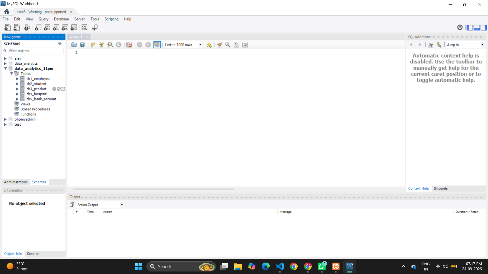

# what is SQL ?

1. SQL stands for **structured query language**
2. SQL used for create database | tables structured  
3. SQL is a case insenstive query language
**examples**
```
insert | INSERT | Insert
```
4. SQL is used to create structured of database and tables via its **query or command**
5. SQL is create logics and functional
6. SQL execute query 
7. SQL create views or index to fast load data 
8. SQL create a structured data 

**structured data formate column and rows**
**examples**

|   id      |   name       |     age     |    address     |
|-----------|--------------|-------------|----------------|
|  1        |    Ajay      |     25      |    rjt         |
|  2        |    axay      |     25      |    rjt         |
|  3        |    mansi     |     25      |    rjt         |
|  4        |    bansi     |     25      |    rjt         |
|  5        |    prince    |     25      |    rjt         |  


# types of SQL query or commands 

1. **DDL (data definition language)**
2. **DML (data manipulation language)**
3. **DQL (data query language)**
4. **TCL (transactional control language)**


# DDL (data definition language)

1. stands for data definition language
2. create an structured of database and tables 
3. rename tables 
4. update | add | modify | drop data in tables or columns in tables 
5. truncate data from tables 

**DDL query are**

1. create 
2. alter 
3. rename 
4. drop 
5. truncate 
6. change 

# how to create database and table structured 

1. create a database 

**syntax**

```
create database databasename;
```

**examples**

```
create database data_analytics_11am
```

2. create a table  structured

**syntax**

```
create table tablename
(
id datatype (size) auto_increment primary key,
columnname datatype (size),
.
.
.
.
.
.
columnname datatype(size)
);

```

**examples**

```
create table tbl_employee(
empid int AUTO_INCREMENT primary key,
name varchar(255),
age int,    
address text, 
salary decimal(10,2),
city varchar(100),
department varchar(200)   
);

```

# what is datatypes and size of column name is tables 

| Column / Field | Data Type | Description |
|---|---|---|
| name | CHAR(0–255) | Stores fixed-length character/string data. Intended for characters/text only. |
| name | VARCHAR(0–255) | Stores variable-length character/string data. Can contain letters, numbers, spaces, and special characters. |
| id | INT | Stores whole numbers, commonly used for IDs and numeric values. |
| bigint_id | BIGINT | Stores very large whole numbers, commonly used for large IDs. |
| age | TINYINT | Stores small whole numbers, commonly used for values such as age. |
| amount | DECIMAL(p,s) | Stores exact decimal numbers, commonly used for money and financial values. |
| price | FLOAT | Stores approximate decimal/floating-point numbers. |
| percentage | DOUBLE | Stores approximate decimal numbers with higher precision than FLOAT. |
| is_active | BOOLEAN | Stores a true/false value. |
| status | ENUM | Stores one value from a predefined list of allowed values. |
| description | TEXT | Stores variable-length text without a small VARCHAR-style limit. |
| long_description | LONGTEXT | Stores very large amounts of text. |
| code | CHAR(n) | Stores fixed-length text. Useful for values with a known, consistent length, such as country codes. |
| email | VARCHAR(255) | Stores email addresses as variable-length text. |
| phone | VARCHAR(20) | Stores phone numbers. VARCHAR is preferred because phone numbers may contain `+`, spaces, `-`, etc. |
| url | VARCHAR(2048) | Stores website or URL strings. |
| date_of_birth | DATE | Stores a calendar date in `YYYY-MM-DD` format. |
| created_at | DATETIME | Stores date and time without timezone conversion. |
| updated_at | TIMESTAMP | Stores a date and time, commonly used for record creation/update timestamps. |
| time | TIME | Stores a time value such as `14:30:00`. |
| year | YEAR | Stores a year value. |
| json_data | JSON | Stores structured JSON data. |
| binary_data | BLOB | Stores binary data such as files or raw bytes. |
| uuid | CHAR(36) | Stores a UUID string such as `550e8400-e29b-41d4-a716-446655440000`. |


**create a 5 tables**

**tbl_reviews**

```
create table tbl_reviews(

    rid int AUTO_INCREMENT primary key,
    name varchar(250),
    email varchar(255),
    phone bigint,
    rating enum('*','**','***','****','*****'),
    COMMENT text
    
)

```

# create the thinks in workbench database 
# work bench view



```
CREATE TABLE `data_analytics_db_11am`.`tbl_employee` (
empid int auto_increment primary key,
name varchar(255),
password varchar(255),
age tinyint,
salary decimal(10,2),
department varchar(255),
address text

);
```

# alter : 

1. alter is used to add new column after create a table 
2. alter is used to modify | rename | or delete a column name is table 
3. alter is used to add unique key of any column name 

**examples**

1. alter table tbl_employee add country varchar(255);
2. alter table tbl_employee add state varchar(255);
3. alter table tbl_employee add city varchar(255);
4. alter table tbl_employee add photo blob after name;
5. ALTER TABLE tbl_users
ADD COLUMN country VARCHAR(255) AFTER pincode,
ADD COLUMN state VARCHAR(255) AFTER country,
ADD COLUMN city VARCHAR(255) AFTER state;
6. alter table tbl_users change photo  upload_photo blob;
7. alter table tbl_users drop created_at;
8. alter table tbl_users add UNIQUE(`email`);


# rename table:
1. after create table via SQL we can changed a table name via **rename**
  **examples**
  ```
   rename table tbl_country to country
   or
   rename table tbl_users to users

  ```

# rename database name :

  ```  
 CREATE DATABASE IF NOT EXISTS data_analytics_db_11am_tts;
 DROP DATABASE IF EXISTS data_analytics_db_11am;

  ```
# change :

1. change is a **keyword** that can be changed the column name of table

**examples**

```
alter table employee change photo upload_photo blob;
```
  

# drop : 

1. drop is used to drop database after drop we can not rollback 
2. drop is also used to drop table after drop we never rollback data or its structures 
3. drop is also delete a column name 

# note : after drop we never rollback

**examples**

```
drop database data_analytics_db_11am_tts;
or
drop table users;
or 
drop table users
or
alter table users drop upload_photo;
or 
ALTER TABLE users
DROP COLUMN `state`,
DROP COLUMN `city`;

```

# truncate :

1. truncate is used to empty all data from tables 
2. after truncate we never rollback data from tables

**examples**

```
truncate table users;
or 
truncate table review
```
# after truncate we never rollback data

# **DML (data manipulation language)**

1. DMl is used to insert single data or multiple data in tables 
2. DMl is used to delete all data or particular one data or alternate data or range of data from tables
3. DMl is used to update single data or multiple data in tables 

**examples**

1. **insert a single data or row**
**examples**

```
insert into country (cname,created_at) values('india','29/09/2026')
```

2. **insert a multiple data or row**
**examples**

```
insert into country (cname,created_at) values('usa','29/09/2026'),('australia','29/09/2026'),('uk','29/09/2026'),('iran','29/09/2026')

or
insert into country (cname,created_at) values('usa','29/09/2026'),('australia','29/09/2026'),('uk','29/09/2026'),('iran','29/09/2026')
or

insert into country values(null,'canada','29/09/2026'),(null,'thailand','29/09/2026'),(null,'china','29/09/2026'),(null,'japan','29/09/2026')

```
   
**update data or row**

1. update a single data 
   **examples**
   ```
   update country set cname='america' where cid=9;
   or
   update country set cname='bharat', created_at='27/09/2026' where cid=1;

   ```

**delete data or rows**

1. delete all data 
   **examples**
   ```
   delete from country;
   ```
2. delete one  data from table 
   **examples**
   ```
   delete from country where cid=2;
   ```

3. delete one  data from table via its name 
   **examples**
   ```
   delete from country where cname='america';
   ```

4. delete alternate  data from table 
   **examples**
   ```
   delete from country where cid in (2,4,6);
   ```

5. delete range of   data from table 
   **examples**
   ```
   delete from country where cid between 100 and 255;
   ```